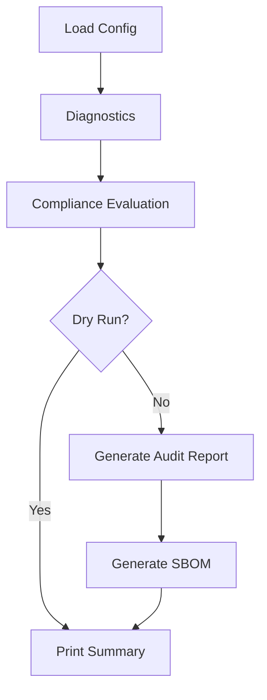

# zspin Workflow Diagram

## Stepwise diagnostics

1. Platform identity check.
2. Required toolchain availability check (`git`, `python3`).
3. Compliance control state evaluation.
4. Audit + SBOM artifact output.
